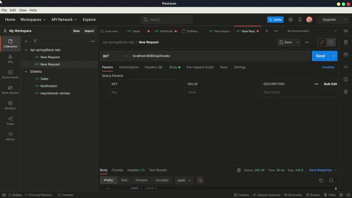

# Data Book
<b align="left" >
Esse é um projeto que salva dados de um livro. 
</b>

## Índice 

* [Sobre](#sobre)
* [Tecnologias](#tecnologias)
* [Descrição do Projeto](#descrição-do-projeto)
* [Autor](#autor)

## Sobre

Este projeto é uma API básica que usa os métodos de requisição HTTP: GET, POST, PUT e DELETE para salvar nome, ano, edição e autor de um livro.

<h1 align="center">
    
</h1>

## Tecnologias
As seguintes ferramentas foram utilizadas na construção do projeto:
* Spring Boot
* Java
* Banco de dados MySql

## Autor

 

